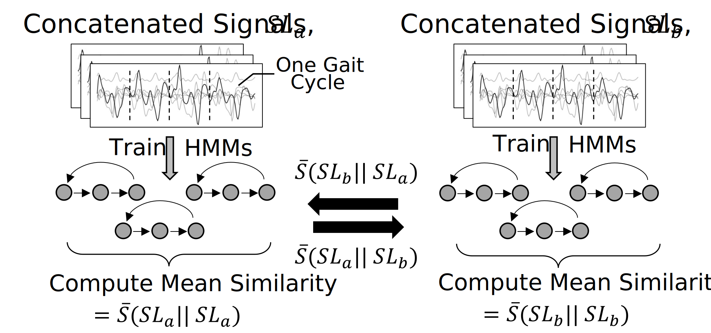
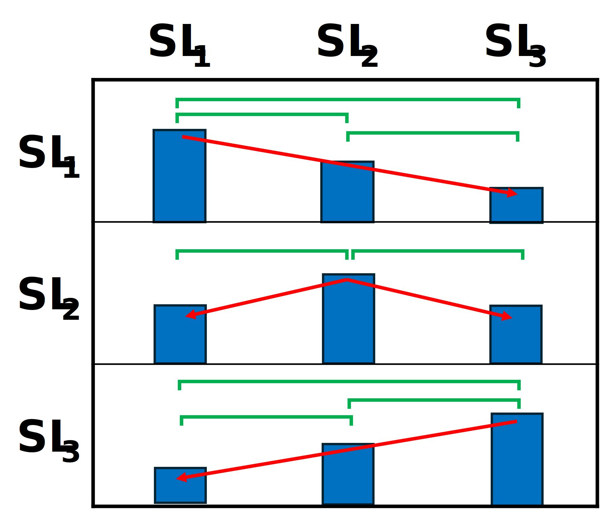

# Overview

<div align="left">

Effective rehabilitation and gait monitoring are essential for helping individuals with gait disabilities to improve movement and quality of life. Despite advancements in wearable gait analysis technology, clinical practice still relies heavily on observational methods, and practical adoption of these technologies remains limited. This work investigates machine learning approaches to inertial sensor data, to develop clinically relevant gait analysis methods and address barriers to adoption of gait analysis technology.

This work primarily explored using a hidden Markov model-based similarity measure (HMM-SM) for unsupervised assessment of gait patterns based on data from inertial sensors. We also adapted other techniques for time-series analysis to compare multiple methods and characterize performance. 

We investigated multiple paradigms and strategies for gait assessment, including assessing relative changes within individual's and absolute assessment of gait quality. Both the relative and absolute paradigms employed the same sets of models, but employed different frameworks for assessing and comparing gait data. This demonstrates the potential flexibility of our methods for assessing overall gait patterns at different scales (e.g., individual-specific changes over short timespans as well as differences between individuals in a population), reducing or eliminating the need for labeling data, retraining models, and collecting large datasets.

<div align="center">

<p float="left">
  
  
  
</p>

<div align="left">

# Repo Organization
### <u>Examples</u>
Example files are contained in the [examples](./examples) folder.

[Gait Pattern Changes](<./examples/Gait Pattern Changes/>) includes experiments for assessing relative changes in lower-limb amputee gait patterns. Written in combination by Emilie Kuepper with supervision by Gabriel Ng.

[gait_quality_analysis.py](./examples/gait_quality_analysis.py) assesses the HMM-SM and other measures for absolute gait assessment, and was written by Gabriel Ng

### <u>src</u>
python files used primarily by gait_quality_analysis.py for gait quality assessment.

### <u>Jupyter files</u>
Mostly playground testing for preliminary analysis, before being ported to .py files for running on remote servers.

# Publications
These code have been used for 1 published work (Sensors) and 2 submitted works (Journal of NeuroEngineering and Rehabilitation, IEEE Transactions on Neural Systems and Rehabilitation Engineering). 

### <u>Published</u>

<details>
<summary>
Ng, G.; Gouda, A.; Andrysek, J. Quantifying Asymmetric Gait Pattern Changes Using a Hidden Markov Model Similarity Measure (HMM-SM) on Inertial Sensor Signals. Sensors 2024, 24, doi:10.3390/S24196431. (Expand for bibtex citation)
</summary>

```bibtex
@article{Ng2024,
    title = {Quantifying Asymmetric Gait Pattern Changes using a Hidden Markov Model Similarity Measure (HMM-SM) on Inertial Sensor Signals},
    author = {Gabriel Ng and Aliaa Gouda and Jan Andrysek},
    doi = {10.3390/S24196431},
    file = {:C\:/Users/Gabriel Ng/Downloads/sensors-24-06431.pdf:pdf},
    journal = {Sensors},
    keywords = {gait assessment,gait disabilities,machine learning,unsupervised learning,wearable sensors},
    number = {19},
    url = {https://www.mdpi.com/1424-8220/24/19/6431},
    volume = {24},
    year = {2024}
}
```
</details>

### <u>In Review (Tentative Citations)</u>

Ng, G.; Andrysek, J. Hidden Markov Model-Based Similarity Measure (HMM-SM) for Gait Quality Assessment of Lower-Limb Prosthetic Users Using Inertial Sensor Signals. J. Neuroeng. Rehabil. 2024.

Ng, G.; Kuepper, E.; Gouda, A.; Andrysek, J. Parameter-Less Assessment of Gait Pattern Changes in Lower Limb Amputees Using Inertial Sensor Data. IEEE Trans. Neural Syst. Rehabil. Eng. 2024.

# Author Information

<div align="left">

This work was undertaken by [Gabriel Ng](https://github.com/gabepierng), with contributions by [Emilie Kuepper](https://www.linkedin.com/in/emilie-kuepper/?originalSubdomain=ca) and supervision by Dr. [Jan Andrysek](https://bme.utoronto.ca/faculty-research/core-faculty/jan-andrysek/). More work from the lab can be found at the [PROPEL Lab website](https://hollandbloorview.ca/research-education/bloorview-research-institute/research-centres-labs/propel-lab).

The datasets used for this research are not public due to ethics approval and restrictions. Upon reasonable request, data may be made available for analysis. For questions related to this, please contact Jan Andrysek.